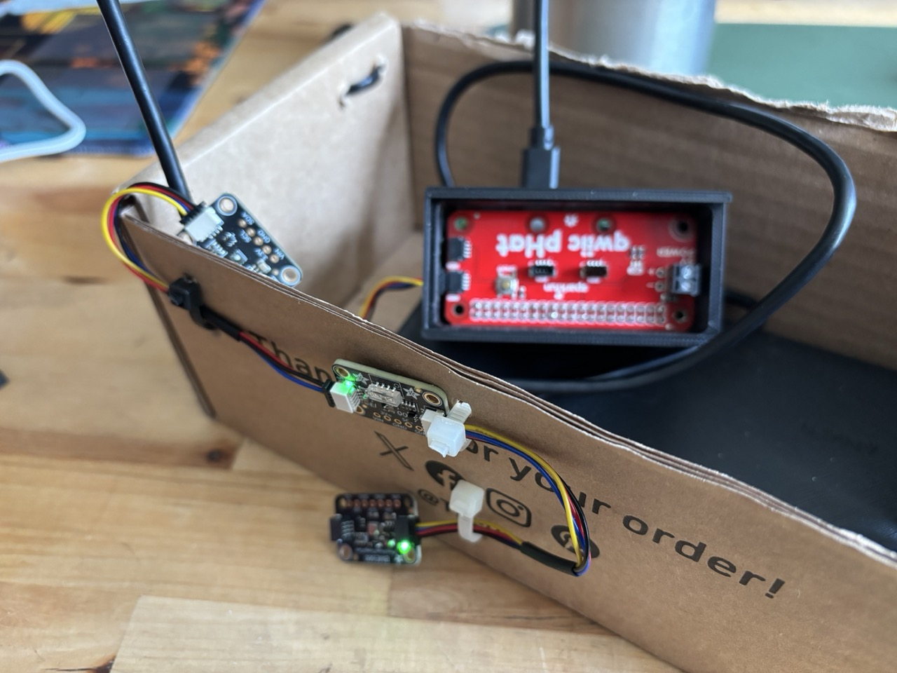

# pragmatic-bookshelf-build-weather-station

The official code repository can be found [here](https://github.com/akoutmos/nerves_weather_station)

## Sensors

### Adafruit SGP40 air quality sensor

0x59 => :sgp40

* [Guide](https://learn.adafruit.com/adafruit-sgp40/overview)
* [Product Info](https://cdn.sparkfun.com/assets/e/9/3/f/e/GAS_AN_SGP40_VOC_Index_for_Experts_D1.pdf)
* [Datasheet](https://cdn-learn.adafruit.com/assets/assets/000/097/511/original/Sensirion_Gas-Sensors_SGP40_Datasheet.pdf?1607381770)

### Adafruit VEML7700 Ambient Light Sensor

0x10 => :veml7700

* [Guide](https://learn.adafruit.com/adafruit-veml7700)
* [Datasheet](https://www.vishay.com/docs/84286/veml7700.pdf)

### Adafruit BME680 Temperature, Humidity, Pressure and Gas Sensor

0x77 => :bme680

* [Guide](https://learn.adafruit.com/adafruit-bme680-humidity-temperature-barometic-pressure-voc-gas)
* [Datasheet](https://cdn-shop.adafruit.com/product-files/3660/BME680.pdf)

## Janky Box

Right now the poor device is a mixture of used cardboard boxes
old Pi containers and cable ties.

I need to get on it with Fusion and design and print a better box